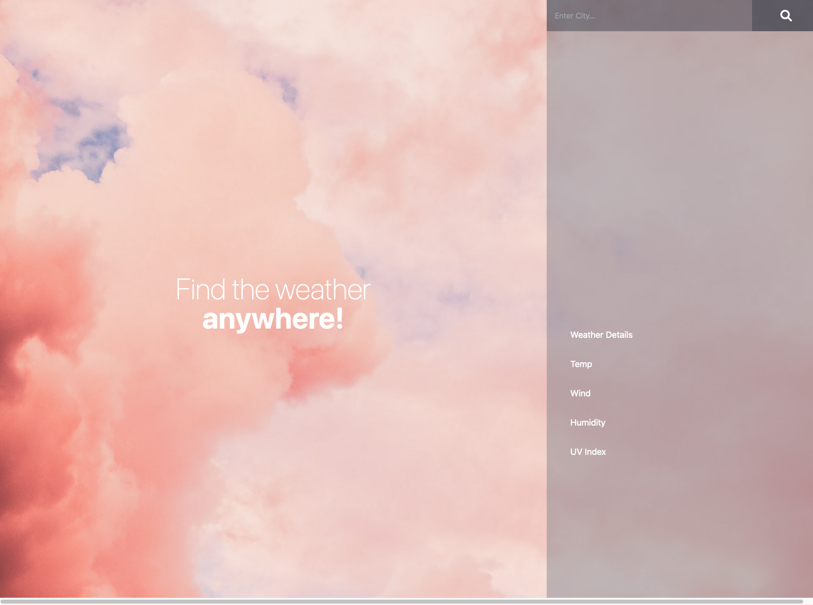

<!-- https://github.com/othneildrew/Best-README-Template -->

<!-- PROJECT LOGO -->
 

  

<h3 align="center">Weather App</h3>

  

    A weather app to search by city using the Openweather API.
     
     
     
    <a href="https://garrettlockhart.github.io/weather-app/">View Demo</a>
    ·
    <a href="https://github.com/GarrettLockhart/weather-app/issues">Report Bug</a>
    ·
    <a href="https://github.com/GarrettLockhart/weather-app/issues">Request Feature</a>
  

 
 
 

<!-- TABLE OF CONTENTS -->

  
Table of Contents

  <ol>
    <li>
      <a href="#about-the-project">About The Project</a>
        <li><a href="#built-with">Built With</a></li>
    </li>
    <li><a href="#live-site">Live Site</a></li>
  </ol>

 

<!-- ABOUT THE PROJECT -->

## About The Project

This project uses the Openweather API to display weather for whatever city you search, it will display your recent searches, and the 5 day forecast for that city, you can click on any of the recent searches to see the weather for that city again.

### Built With

- [HTML5](https://developer.mozilla.org/en-US/docs/Web/HTML)
- [Tailwind](https://tailwindcss.com/)
- [JavaScript](https://developer.mozilla.org/en-US/docs/Web/JavaScript)
- [JQuery](https://jquery.com/)
- [Momentjs](https://momentjs.com/)

<!-- CONTRIBUTING -->

## Contributing

Any contributions you make are **greatly appreciated**.

If you have a suggestion that would make this better, please fork the repo and create a pull request. You can also simply open an issue with the tag "enhancement".
Don't forget to give the project a star! Thanks again!

1. Fork the Project
2. Create your Feature Branch (`git checkout -b feature/AmazingFeature`)
3. Commit your Changes (`git commit -m 'Add some AmazingFeature'`)
4. Push to the Branch (`git push origin feature/AmazingFeature`)
5. Open a Pull Request

<!-- CONTACT -->

## Live Site

Project Link: [https://garrettlockhart.github.io/weather-app/](https://garrettlockhart.github.io/weather-app/)
 
 

(<a href="#top">back to top</a>)

